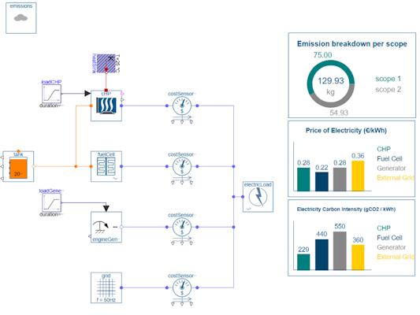



    



# Modelica Association Newsletter 2026-01

issued on March 5, 2026





    <i class="fa-regular fa-envelope" style="font-size:50px"></i>



## Letter from the Board



    <i class="fa-solid fa-building-columns" style="font-size:50px"></i>



## Modelica Association

<!-- END Modelica Association -->



    <i class="fa-solid fa-users" style="font-size:50px"></i>



## Conferences and user meetings

<!-- END Conferences and user meetings -->



    <i class="fa-solid fa-industry" style="font-size:50px"></i>



## Vendor news
### Dymola Sustainable Supply Systems Library Update

Dassault Systèmes is happy to announce an update to the [Sustainable Supply Systems library (SuSy)](https://blog.3ds.com/brands/catia/catia-dymola-from-concept-to-prototype-in-minutes-simplifying-hybrid-energy-system-modeling-with-the-sustainable-supply-systems-library/).  
Version 1.1.0 represents a substantial update and expansion of scope of the library.  
Key new features and changes include:

- Techno-economic assessments
  - CAPEX, OPEX, Levelized Cost of Energy for both components and systems
- Emission tracking per scope
  - Emissions split into scope 1 and scope 2 as per [The Greenhouse Gas Protocol](https://ghgprotocol.org/sites/default/files/standards/ghg-protocol-revised.pdf)
  - Electricity carbon intensity tracked at electrical ports
- Examples
  - Methanol cruise ship with methanol to hydrogen reformer
  - Green hydrogen production with electrolyzer
  - Green ammonia with ammonia plant component

This article is provided by Markus Andres ([Dassault Systemes Austria GmbH](https://www.3ds.com/))
<!-- END Vendor news -->



    <i class="fa-solid fa-book" style="font-size:50px"></i>



## News from libraries

<!-- END News from libraries -->



    <i class="fa-solid fa-graduation-cap" style="font-size:50px"></i>



## Education news

<!-- END Education news -->
